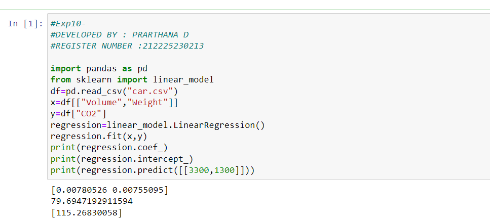

# Implementation of Multivariate Linear Regression
## Aim
To write a python program to implement multivariate linear regression and predict the output.
## Equipment’s required:
1.	Hardware – PCs
2.	Anaconda – Python 3.7 Installation / Moodle-Code Runner
## Algorithm:
Step 1: Load DataRead the CSV file into a data table.
Step 2: Split VariablesSeparate the cause variables (Volume, Weight) from the effect variable (CO2).
Step 3: Train ModelFind the line of best fit through the data points using ordinary least squares.
Step 4: Extract FormulaCalculate the baseline value (intercept) and the impact weight (coefficients) for each feature.
Step 5: PredictMultiply the new inputs by their respective weights, add the baseline, and output the final result.

## Program:
```
import pandas as pd
from sklearn import linear_model
df=pd.read_csv("car.csv")
x=df[["Volume","Weight"]]
y=df["CO2"]
regression=linear_model.LinearRegression()
regression.fit(x,y)
print(regression.coef_)
print(regression.intercept_)
print(regression.predict([[3300,1300]]))


```


### Insert your output



## Result
Thus the multivariate linear regression is implemented and predicted the output using python program.